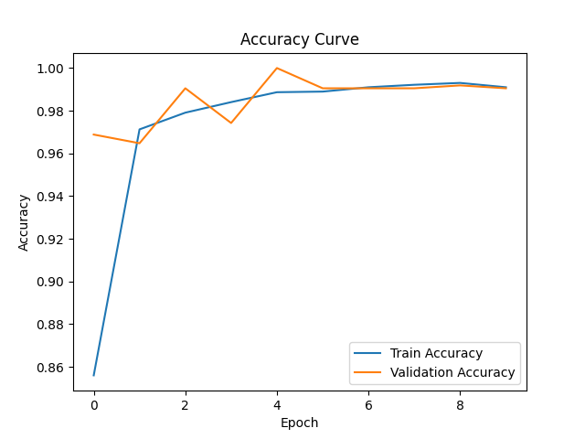

# 🖥️ News Analysis and Summarization System

## 📌 Project Overview
This project focuses on analyzing and summarizing news articles using Natural Language Processing (NLP) techniques. The system processes textual data from news datasets and generates meaningful insights such as summaries, classifications, and visualizations.

---

## 🎯 Objective
- Analyze news articles from dataset  
- Generate summaries of long text  
- Perform text processing and visualization  
- Extract meaningful insights from news data  

---

## 📂 Dataset
- Dataset used: BBC News Archive  
- Source: https://www.kaggle.com/datasets/hgultekin/bbcnewsarchive  
- Contains news articles from multiple categories  

---

## ⚙️ Technologies Used
- Python  
- NLP (Natural Language Processing)  
- Transformers (BART Model)  
- Pandas  
- Matplotlib  
- Seaborn  

---

## 🚀 Project Workflow

1. **Data Loading**
   - Load BBC News dataset  

2. **Data Preprocessing**
   - Text cleaning  
   - Tokenization  
   - Removing stopwords  

3. **Text Summarization**
   - Used BART model for summarizing news articles  

4. **Analysis & Visualization**
   - Category distribution  
   - Text insights using graphs  

5. **Evaluation**
   - Generated summaries and analyzed performance  

---

## 📊 Results
- Successfully generated summaries for news articles  
- Improved readability of long texts  
- Visualized dataset distribution using graphs  

---

## 📸 Output Samples

### 🔹 Sample Visualizations

### 🔹 Annotated Outputs

---

## 📌 Conclusion
This project demonstrates how NLP techniques can be used to analyze and summarize large volumes of text data efficiently. It helps in reducing reading time and extracting key information.

---

## 🔮 Future Scope
- Improve summarization using advanced models  
- Add real-time news summarization  
- Deploy as a web application  

---

## 👤 Author
**Vishal Reddy**

---

## 📜 License
This project is licensed under the MIT License.
