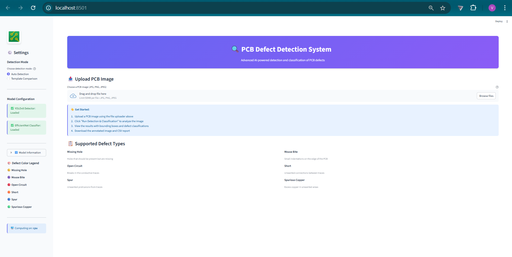
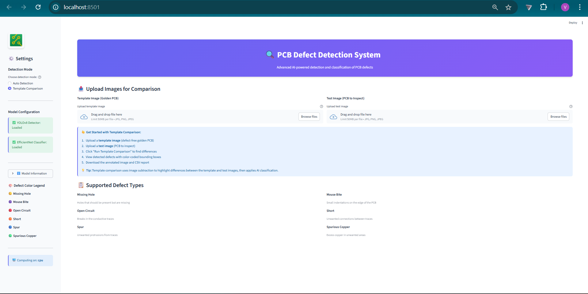
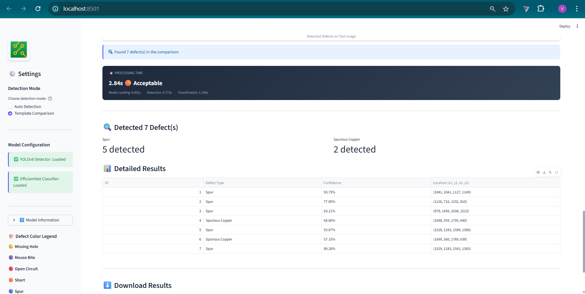
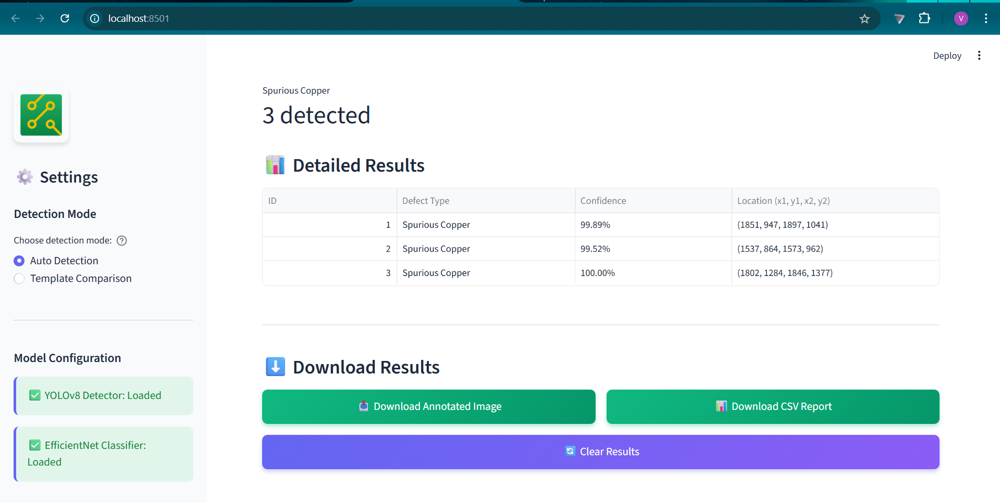
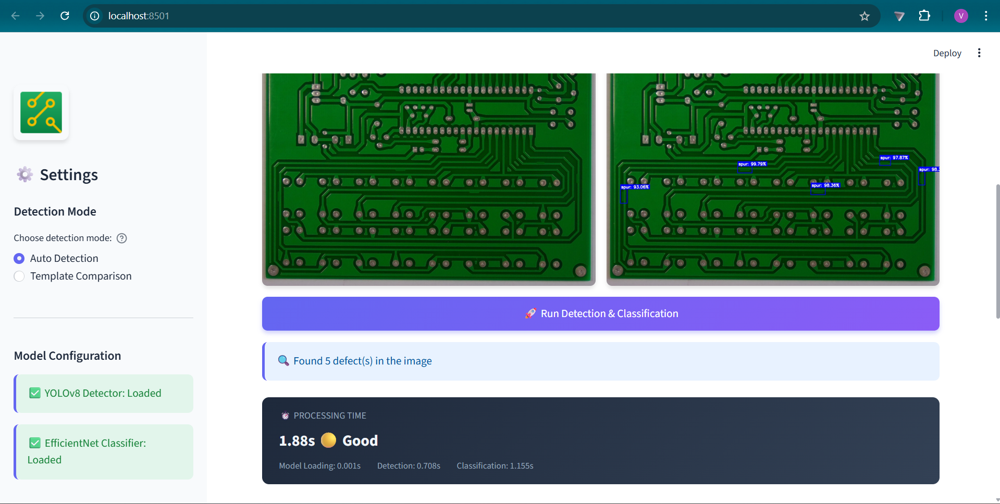
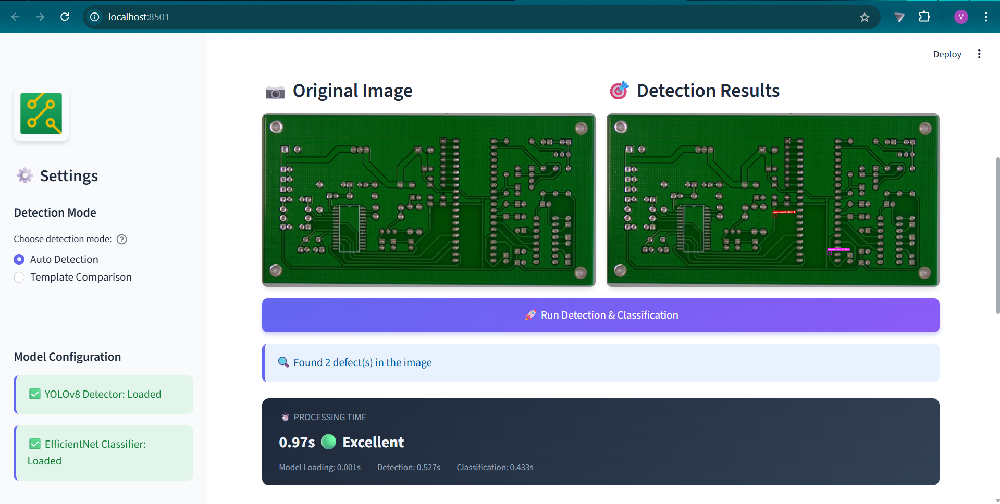

<div align="center">

# PCB Defect Detection & Classification System


<br/>


</div>

---

An end-to-end deep learning system for detecting and classifying defects in Printed Circuit Boards (PCBs). The model is **custom-trained on the DeepPCB dataset** using **EfficientNet-B0** architecture, achieving **96% classification accuracy** across 6 defect types.

---

## Table of Contents

- [Features](#features)
- [Screenshots](#screenshots)
- [Defect Classes](#defect-classes)
- [Project Structure](#project-structure)
- [Tech Stack](#tech-stack)
- [Installation](#installation)
- [Usage](#usage)
  - [Run Module 1 Pipeline](#run-module-1-pipeline)
  - [Run Module 2 Pipeline](#run-module-2-pipeline)
  - [Run Web Application](#run-web-application)
- [Milestones](#milestones)
- [Results](#results)
- [License](#license)
- [Acknowledgements](#acknowledgements)

---

## Features

- **Image Subtraction & Thresholding** — Aligns template and test PCB images, applies subtraction and Otsu's thresholding to generate defect masks.
- **Contour Detection & ROI Extraction** — Detects defect contours using OpenCV, extracts bounding boxes, and crops individual defect regions.
- **Custom Trained Defect Detection** — Model trained on the DeepPCB dataset to detect and localize defects on PCB images.
- **EfficientNet-B0 Classification** — Custom-trained classifier on extracted defect ROIs, achieving 96% accuracy across 6 defect categories.
- **Streamlit Web UI** — Upload template and test PCB images, view detection results with bounding boxes and labels.
- **Export Results** — Download annotated images and prediction logs as CSV.

---

## Screenshots

### 1. Home Page
The main dashboard with navigation tabs for single image detection and template comparison mode.



### 2. Image Upload
Upload interface for selecting PCB images to analyze. Supports single image defect detection.



### 3. Defect Summary Table
Detailed summary of all detected defects with classification labels and confidence scores.



### 4. Export Results
Download options to export annotated images and CSV reports with defect information.



### 5. Processing Timing
Real-time performance metrics showing detection and classification execution time.



### 6. Detection Results
Annotated images with bounding boxes and defect labels clearly marking detected defects.



---

## Defect Classes

| # | Defect Type      | Description                          |
|---|------------------|--------------------------------------|
| 1 | Missing Hole     | Holes that are absent on the PCB     |
| 2 | Mouse Bite       | Irregular gaps on copper traces      |
| 3 | Open Circuit     | Broken copper traces                 |
| 4 | Short            | Unintended connections between traces|
| 5 | Spur             | Unwanted copper protrusions          |
| 6 | Spurious Copper  | Extra copper deposits on the board   |

---

## Project Structure

```
PCB-Defect-Detection/
├── backend/
│   ├── scripts/
│   │   ├── 0_setup_model.py                # Load and verify YOLOv8 model
│   │   ├── 1_explore_dataset.py             # Inspect and visualize DeepPCB dataset
│   │   ├── 2_image_subtraction.py           # Image alignment, subtraction & thresholding
│   │   ├── 2_load_pretrained_model.py       # Load pretrained model weights
│   │   ├── 3_run_inference_extract_rois.py  # Run YOLOv8 inference and extract ROIs
│   │   ├── 4_create_visualizations.py       # Generate result visualizations
│   │   ├── run_module1_complete.py          # Run full Module 1 pipeline
│   │   └── milestone2/
│   │       ├── 1_prepare_data.py            # Split ROIs into train/val/test sets
│   │       ├── 2_train_classifier.py        # Train EfficientNet-B0 classifier
│   │       ├── 3_evaluate_model.py          # Evaluate model and generate reports
│   │       ├── 5_inference_pipeline.py      # Run inference on new images
│   │       └── run_milestone2.py            # Run full Milestone 2 pipeline
│   ├── utils/
│   │   ├── inference.py                     # Detection and classification pipeline
│   │   ├── visualization.py                 # Visualization helper functions
│   │   └── export.py                        # Export results (images, CSV logs)
│   ├── models/                              # Trained model weights (.pt files)
│   ├── data/                                # Dataset (raw, masks, diffs, ROIs)
│   ├── results/                             # Output visualizations and reports
│   ├── logs/                                # Execution logs
│   └── requirements.txt                     # Python dependencies
├── frontend/
│   ├── app.py                               # Streamlit web application
│   └── .streamlit/config.toml               # Streamlit theme configuration
├── start_webapp.sh                          # Launch script (Linux/Mac)
├── start_webapp.bat                         # Launch script (Windows)
├── .gitignore
└── README.md
```

---

## Tech Stack

| Category           | Technology                                  |
|--------------------|---------------------------------------------|
| Language           | Python 3.11                                 |
| Detection Model    | Custom-trained on DeepPCB dataset           |
| Classification     | EfficientNet-B0 (PyTorch)                   |
| Image Processing   | OpenCV, NumPy, Pillow                       |
| Data Visualization | Matplotlib                                  |
| ML Utilities       | scikit-learn                                |
| Web Framework      | Streamlit                                   |
| Dataset            | DeepPCB                                     |

---

## Installation

### Prerequisites
- Python 3.11+
- Git

### Steps

1. **Clone the repository**
   ```bash
   git clone https://github.com/springboardmentor822-cloud/PCB-Defect-Detection-and-Classification-System.git
   cd PCB-Defect-Detection-and-Classification-System
   git checkout PCB-Defect-Detection-and-Classification-System-Vaishnavi-S
   ```

2. **Create a virtual environment**
   ```bash
   python -m venv venv
   ```

3. **Activate the virtual environment**
   ```bash
   # Windows
   venv\Scripts\Activate.ps1

   # Linux/Mac
   source venv/bin/activate
   ```

4. **Install dependencies**
   ```bash
   pip install -r backend/requirements.txt
   ```

---

## Usage

### Run Module 1 Pipeline
Dataset setup, image subtraction, defect detection, and ROI extraction:
```bash
python backend/scripts/run_module1_complete.py
```

Or run individual scripts:
```bash
python backend/scripts/0_setup_model.py
python backend/scripts/1_explore_dataset.py
python backend/scripts/2_image_subtraction.py
python backend/scripts/3_run_inference_extract_rois.py
python backend/scripts/4_create_visualizations.py
```

### Run Module 2 Pipeline
Data preparation, model training, evaluation, and inference:
```bash
python backend/scripts/milestone2/run_milestone2.py
```

Or run individual scripts:
```bash
python backend/scripts/milestone2/1_prepare_data.py
python backend/scripts/milestone2/2_train_classifier.py
python backend/scripts/milestone2/3_evaluate_model.py
python backend/scripts/milestone2/5_inference_pipeline.py
```

### Run Web Application

**Windows:**
```bash
start_webapp.bat
```

**Linux/Mac:**
```bash
./start_webapp.sh
```

**Manual:**
```bash
streamlit run frontend/app.py
```
The app will open at `http://localhost:8501`

---

## Milestones

### Milestone 1 — Dataset Preparation and Image Processing
- **Module 1:** Dataset setup, image alignment, subtraction, and Otsu's thresholding for defect mask generation.
- **Module 2:** Contour detection using OpenCV, bounding box extraction, and ROI cropping with labeling.

### Milestone 2 — Model Training and Evaluation
- **Module 3:** EfficientNet-B0 model training with data augmentation, Adam optimizer, and cross-entropy loss.
- **Module 4:** Model evaluation on unseen test images, inference pipeline, and ground truth comparison.

### Milestone 3 — Frontend and Backend Integration
- **Module 5:** Streamlit-based web UI for image upload, defect detection, and result visualization.
- **Module 6:** Modularized backend pipeline connecting image processing, model inference, and frontend.

### Milestone 4 — Finalization and Delivery
- **Module 7:** Export functionality for annotated images and CSV prediction logs, performance optimization.
- **Module 8:** Technical documentation, README, user guide, and project presentation.

---

## Results

### Classification Performance (EfficientNet-B0)

| Defect Type      | Precision | Recall | F1-Score |
|------------------|-----------|--------|----------|
| Missing Hole     | 1.00      | 1.00   | 1.00     |
| Mouse Bite       | 0.95      | 0.93   | 0.94     |
| Open Circuit     | 0.98      | 0.96   | 0.97     |
| Short            | 1.00      | 0.97   | 0.98     |
| Spur             | 0.90      | 0.94   | 0.92     |
| Spurious Copper  | 0.94      | 0.97   | 0.95     |
| **Overall**      | **0.96**  | **0.96** | **0.96** |

**Test Accuracy: 96%**

---

## Acknowledgements


- [PyTorch](https://pytorch.org/) — Deep learning framework for model training.
- [OpenCV](https://opencv.org/) — Image processing library.
- [Streamlit](https://streamlit.io/) — Web application framework.


---

## License

This project is licensed under the **MIT License** — see the [LICENSE](LICENSE) file for details.

**MIT License Summary:**
- ✅ Free to use, copy, modify, and distribute
- ✅ No warranty provided
- ✅ Must include license notice
- ✅ Commercial use permitted

For full license text, see: [MIT License](https://opensource.org/licenses/MIT)

---

## Author

**Vaishnavi S**
Infosys Virtual Internship Program

