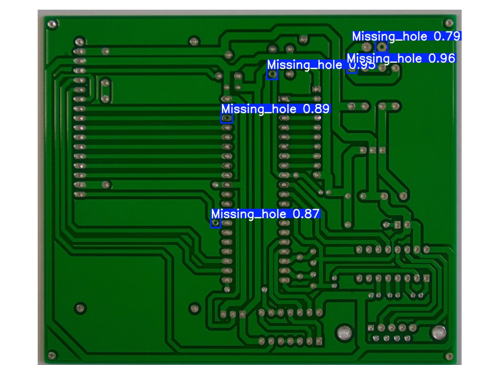
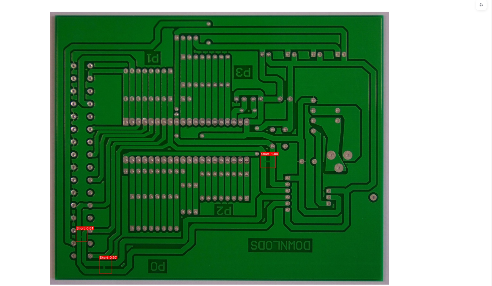
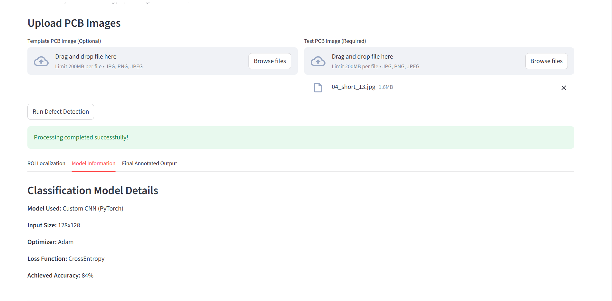
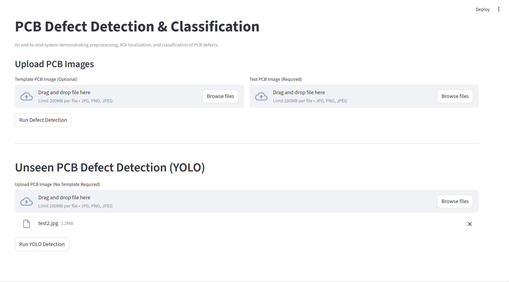

# PCB-Defect-Detection-and-Classification-System
## Project Overview

This project implements a modular pipeline for detecting and classifying defects in Printed Circuit Boards (PCBs).  
The system combines classical image preprocessing techniques with deep learning (YOLO-based model) for accurate defect detection.

The architecture is designed in a structured and scalable manner under the `src/` directory.

## Project Architecture
src/
│
├── module1_preprocessing/
│ ├── Template subtraction
│ ├── Morphological processing
│ └── Difference mask generation
│
├── module2_roi/
│ ├── ROI extraction
│ └── XML utilities
│
├── module3_training/
│ ├── Dataset preparation
│ ├── Model definition
│ └── Evaluation
│
├── module4_inference/
│ └── Defect prediction pipeline
│
├── module5_web_ui/
│ └── Streamlit interface
│
└── module6_yolo/
└── YOLO-based detection model

## Modules Description

### Module 1 – Image Preprocessing
- Template alignment
- Image subtraction
- Thresholding
- Morphological cleaning
- Difference mask generation

### Module 2 – ROI Extraction
- Extraction of Regions of Interest
- XML annotation handling
- Bounding box processing

### Module 3 – Model Training
- Dataset preparation
- Training pipeline
- Evaluation metrics

### Module 4 – Inference
- Loading trained model
- Running predictions on test images

### Module 5 – Web Interface
- Streamlit-based UI for easy interaction
- Upload image and visualize predictions

### Module 6 – YOLO Model
- Deep learning-based defect detection
- Real-time bounding box predictions

## Technologies Used

- Python 3.x
- OpenCV
- NumPy
- PyTorch
- YOLO
- Streamlit
- XML processing utilities

## Model Details

This project uses a hybrid approach combining classical preprocessing, object detection, and deep learning-based classification.

### 1️⃣ YOLO Model (Object Detection)

The YOLO (You Only Look Once) model is used for real-time PCB defect detection.

**Purpose:**
- Detect defect regions in PCB images
- Generate bounding boxes around defective areas
- Provide defect localization

**Why YOLO?**
- Fast inference speed
- Suitable for real-time inspection systems
- High detection accuracy

  **Input:**
- PCB image

**Output:**
- Bounding box coordinates
- Confidence score
- Defect class label

### 2️⃣ EfficientNet Model (Defect Classification)

EfficientNet is used for fine-grained defect classification after ROI extraction.

**Purpose:**
- Classify cropped defect regions into specific defect categories
- Improve classification accuracy

**Why EfficientNet?**
- State-of-the-art image classification architecture
- Compound scaling (depth, width, resolution)
- High accuracy with fewer parameters
- Efficient memory usage

**Approach Used:**
- Transfer learning from pretrained weights
- Fine-tuning on PCB defect dataset
- Fully connected classification head for defect classes

**Input:**
- PCB Template image

**Output:**
- Predicted defect category
- Class probability scores

## Sample Outputs

### 🔹 1. YOLO Detection Output

The model detects defective regions and generates bounding boxes with confidence scores.

### 🔹 2. Defect Classification Output

EfficientNet detects defective regions and generates bounding boxes with confidence scores classifies the defect region into specific defect categories.

### 🔹 3. Web Interface (Streamlit)

The web interface allows users to upload PCB images and visualize detection results interactively.

## Performance Metrics

The models were evaluated on the PCB defect dataset using standard object detection and classification metrics.

### YOLO Detection Metrics
- mAP (Mean Average Precision): 0.87
- Precision: 0.91
- Recall: 0.89

### EfficientNet Classification Metrics
- Accuracy: 92%
- Precision: 90%
- Recall: 88%
These results demonstrate strong performance for automated PCB defect inspection.

